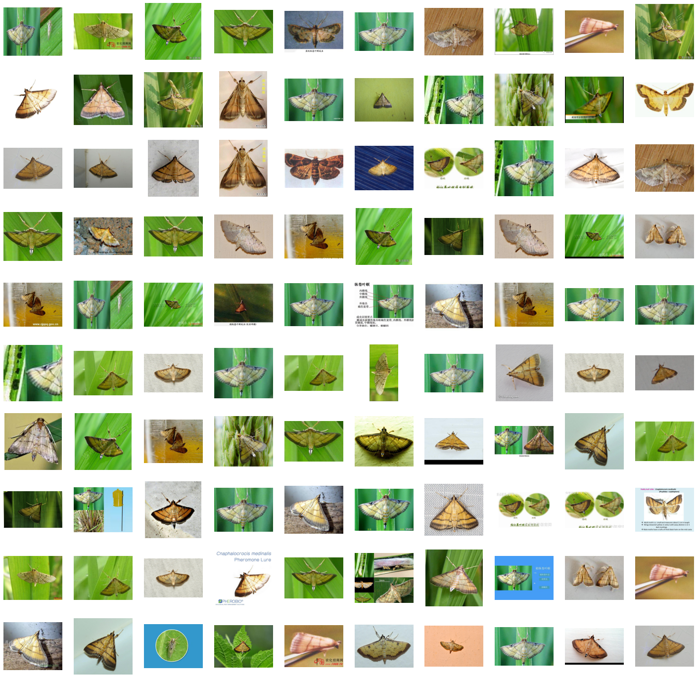
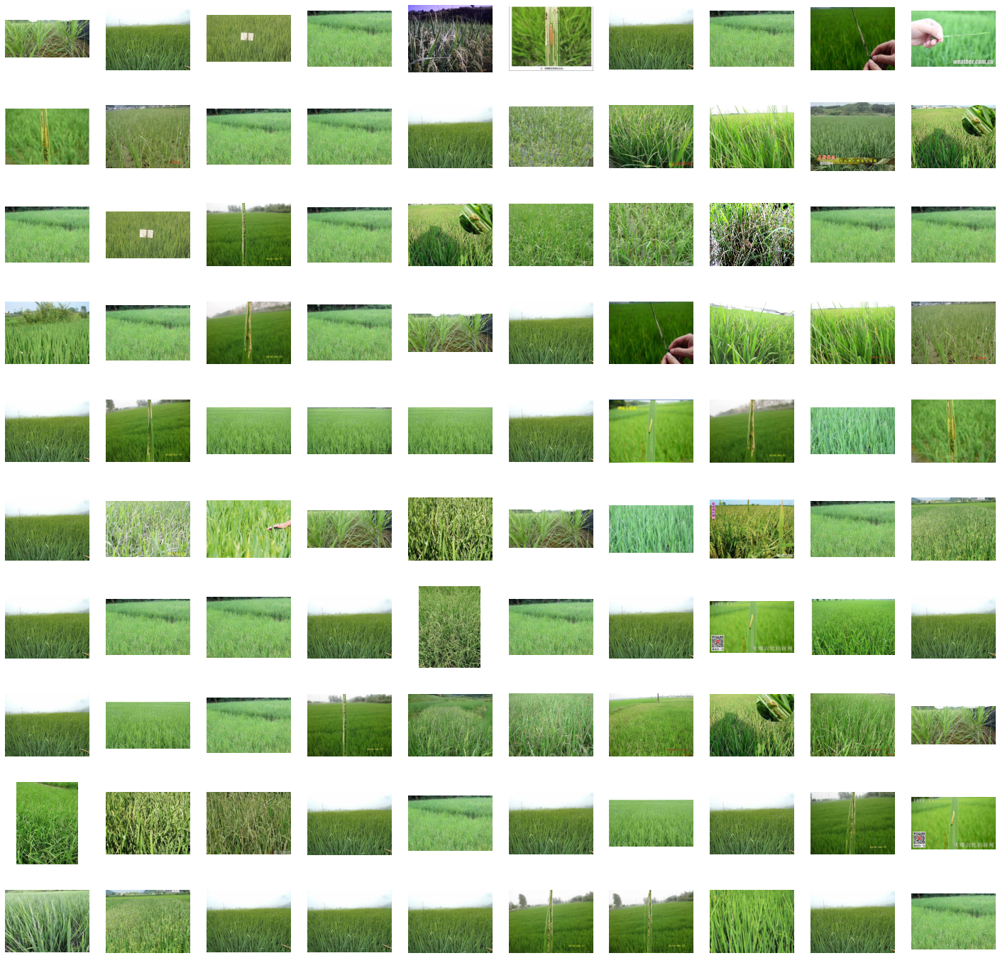
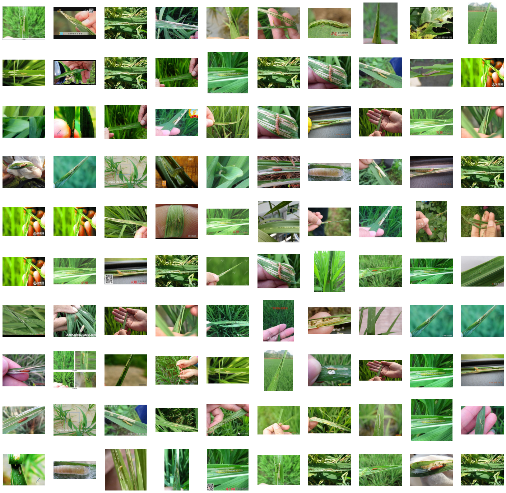
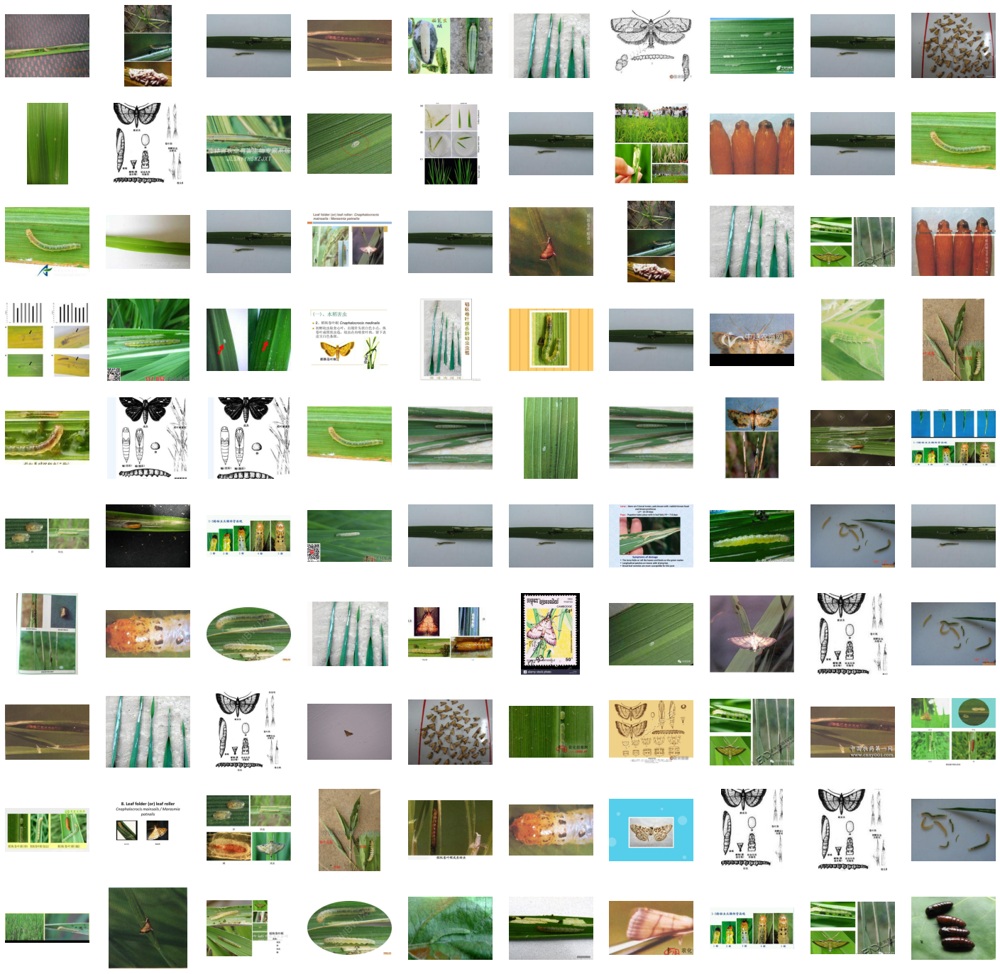
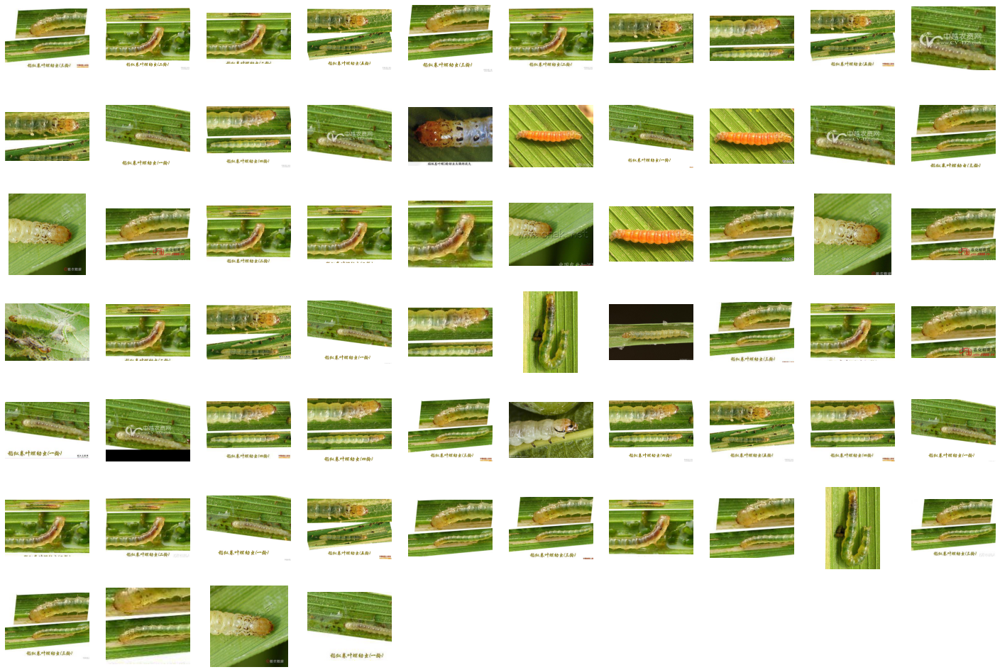
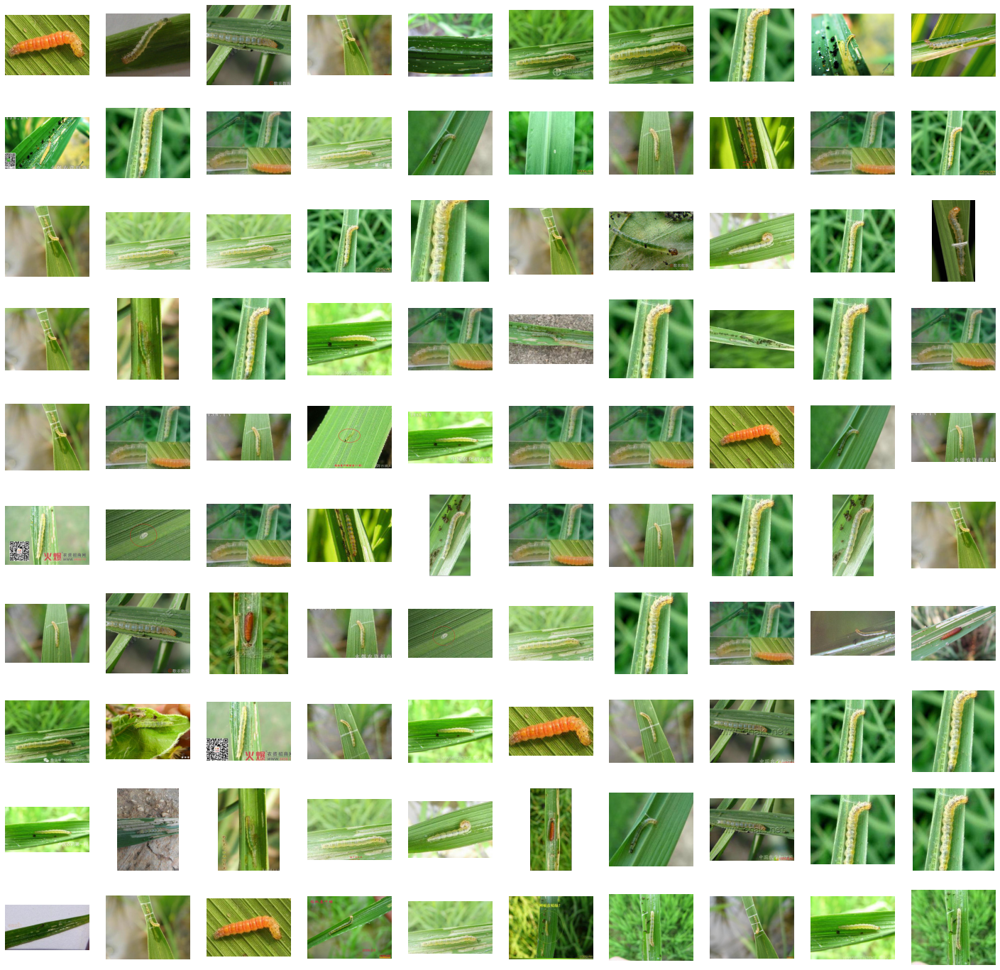

# Semantic-Image-Data-Clustering-using-VGG-19

This Python notebook demonstrates how to use the VGG-19 model for unsupervised image data clustering and analysis. The VGG-19 model is a powerful deep learning architecture commonly used for image classification. However, in this notebook, we will use it for feature extraction and then apply clustering techniques to group similar images together.

## Table of Contents

- [Introduction](#introduction)
- [Requirements](#requirements)
- [Installation](#installation)
- [Results](#results)

## Introduction

Image clustering is a technique that allows us to group similar images together based on their content. This can be useful for various applications, such as organizing large image datasets, discovering patterns in data, or even for recommendation systems.

The dataset used here is the IP102 Pest Image dataset which can be found at https://github.com/xpwu95/IP102.

In this notebook, we will:

1. Flatten the Image and apply PCA to reduce the dimentionality of the image vector.
2. Use the VGG-19 model pre-trained on ImageNet to extract feature vectors from a dataset of image vectors.
3. Apply a clustering algorithm K-means to cluster the feature vectors.
4. Visualize the results to understand the image clusters.

## Requirements

To run this notebook, you will need the following Python libraries:

- `numpy`: for numerical operations
- `tensorflow`: for using the VGG-19 model
- `scikit-learn`: for clustering
- `matplotlib`: for visualization

You can install these dependencies using `pip`:

```bash
pip install numpy tensorflow scikit-learn matplotlib
```

## Results

Visualising the clutered images allows you to understand multiple aspects of you dataset. For instance the type of classes the images fall into visually.

For example:

Cluster 3: images that contain insect resembing creatures:


Cluster 5: images mostly with grass


Another interesting application of this clustering is being able to group noise, garbage or outliers in the data smartly.

Below are examples of clusters that have images that are not usable or irrelevant to the actual dataset.

Cluster 2: images with mostly a person's hand or unsusable FOV.


Cluster 4: images with drawings, diagrams or graphs.


Finally, another observation in the clusters was made, that many times in order to increase the size of the image dataset, data augmentation is applied but not always in the best way which can result in duplicates and almost similar images which ruin the training and accuracy of an ML model. Examples are shown below:

Cluster 6: very similar or duplicate images.


Cluster 7: very similar or duplicate images.

